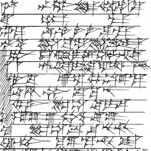

The Old Babylonian corpus
==============================

This repo is about the digital processing of the transliterations of
cuneiform tablets from the Old Babylonian periods.

Cuneiform tablets
=================

Cuneiform tablets have been photographed, and transliterated
in [ATF](http://oracc.museum.upenn.edu/doc/help/editinginatf/cdliatf/index.html)
files, in which the marks on a tablet are represented by ascii characters.

While the ATF descriptions preserve an awesome amount of precise information
about the marks that are visible in the clay and their spatial structure, it is
not easy to process that information. Simple things are hard: counting,
aggregating, let alone higher level tasks such as clustering, colocation, and
other statistical operations.

That is why we have converted the transliterations to an other format,
Text-Fabric, which is optimized for processing, adding data and sharing it.

Corpus
------

We have chosen the
[Old Babylonian letters (AbB)](http://cdli.ox.ac.uk/wiki/doku.php?id=old_babylonian_letters)
(1900-1600 BC) as the second corpus for testing our approach. This is
*cuneiform* corpus of ca. 1300 documents (tablets and envelopes) with legible inscriptions.

The first cuneiform corpus that we have brought into Text-Fabric is the
proto-cuneiform
[Uruk](https://github.com/Nino-cunei/uruk/blob/master/docs/about.md)
corpus.

Provenance
----------

We have downloaded transliterations and images from the **Cuneiform Digital
Library Initiative** [CDLI](https://cdli.ucla.edu).
It has compiled a rich source of
data, available to the public, visible on its website, and large portions are
conveniently downloadable. We are indebted to the creators and maintainers of
the CDLI website.

### Transliterations

On the [search page](https://cdli.ucla.edu/search/search.php) we performed two
searches: one with `AbB` in the *Primary publication* field and one with the same string
in the *Secondary publication(s)* field. In both searches we entered 
`Old Babylonian` in the *Chronology - period* field.
On the results
page, we have chosen `Download all text`.

The downloaded files contain metadata and transliterations.

Currently, we are using the transliterations only.

We have a [specification](docs/transcription.md) of the transcription format and
how we model the text in Text-Fabric.

We have checked the conversion from the ATF transliterations to Text-Fabric
thoroughly.
An account of the checking that we performed is in the
[checks](http://nbviewer.jupyter.org/github/Nino-cunei/oldbabylonian/blob/master/programs/checks.ipynb)
notebook.
